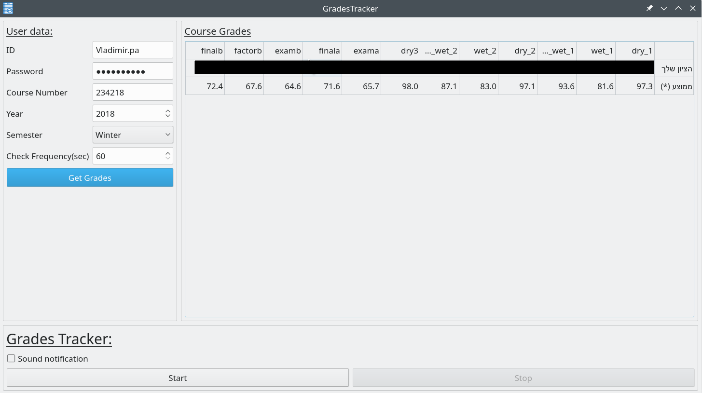

# CourseTracker

## Description

 A program which can help you track your grades from the https://grades.cs.technion.ac.il/
 The program can get your grades from every semester and every course, the program can check and notify you
 if there is any new grade appeared for selected course.

## Dependencies

 In order to run from source make sure to install all those:

 ```bash
 pip install requests
 pip install bs4
 pip install pyqt5
 pip install csvkit
 ```

## Instalation

 From source:
 ```bash
 From console/terminal run:
 python main.py
 ```
 
 ## Screenshots
 
 
  
